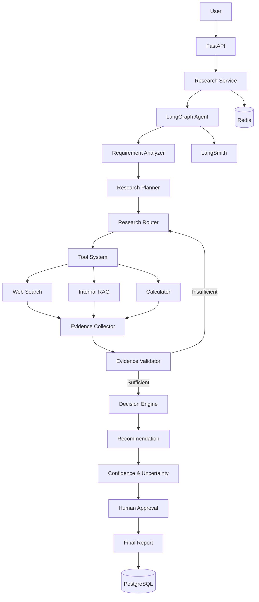

# Aegis System Architecture

## Overview

Aegis is designed as a stateful agentic decision-intelligence system.

The architecture separates:

- API concerns
- application services
- agent orchestration
- domain models
- tools
- retrieval
- persistence
- infrastructure

## High-Level Architecture

